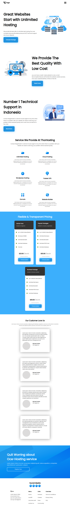

# Hosting Landing Page

- This project is a Hosting landing page.This website is designed using pure HTML and CSS. I have also made this website mobile responsive.

- It took me 10-12hrs to make this project.Please find link of the project below:

---

# Breakpoints

- I have taken **Three** breakpoints to make this website responsive.

  - First at **1024px** for small screen Laptops.
  - Second at **768px** for Tablets.
  - Third at **480px** for Mobiles

---

## 📷 Screenshots

- Desktop View

- Mobile View

---

## 🛠 Skills learned

HTML, CSS, to make responsive page.

---

## 🚀 About Me

### Hey, I am Yasir lambawala

- I am born and brought up in Vadodara, Gujarat. I have done my Btech at GTU university and I am currently learning Web-development.

---

## Feedback

- If you have any feedback, please reach me at lambawalay@gmail.com
